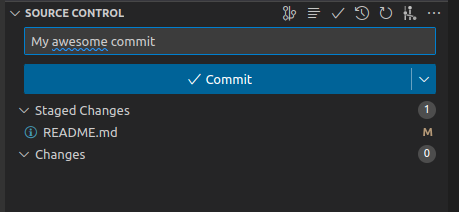

Le but de ce document est de créer un document $\LaTeX$ tous ensemble.
La première étape est de cloner ce dépot sur votre machine.
Ouvrez un dossier où vous souhaitez avoir le dépôt et tapez:

``` 
git clone https://github.com/lcharleux/2023-03-09_demo_git_latex_SIE.git
``` 

Ensuite, vous pouvez modifier un document existant ou en créer un et observer que l'outil de versionnage de GIT dans VSCode a vu ces modifications.


Vous pouvez alors ajouter un message, indiquer à VScode que vous voulez ajouter les modifications à votre commit avec le (+), on dit qu'elles sont *staged*.


